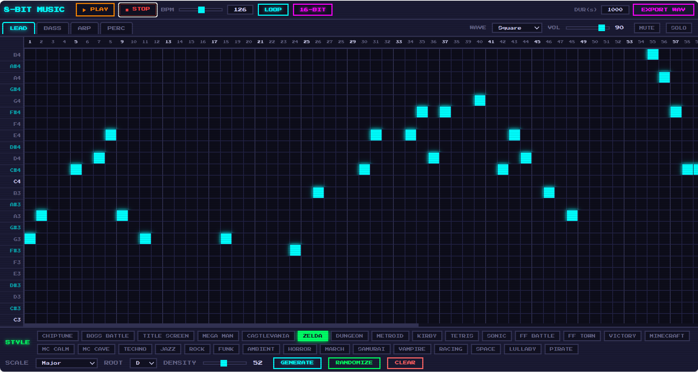

# 8-Bit Music Generator

A browser-based chiptune music generator with a retro sequencer UI. Create, edit, and export chip-style music directly in your browser — no installs, no dependencies, just open `index.html`.

[**Live Demo**](https://andrewberryca.github.io/8bit-music-generator/)



## Features

### Era-Accurate Bit Modes
Toggle between 8-bit, 16-bit, and 32-bit modes that simulate real hardware constraints from each gaming era:

| | 8-bit (NES) | 16-bit (SNES) | 32-bit (Modern) |
|---|---|---|---|
| Waveforms | Square, Triangle, Noise | + Sawtooth, Sine | All |
| Polyphony | 1 note per channel | 2 notes per channel | Unlimited |
| Effects | None | Delay/Echo | Delay + Reverb |
| Filter | 4 kHz lowpass | 12 kHz lowpass | 22 kHz (full range) |
| Quantization | 8 levels (crunchy) | 128 levels (warm) | None (pristine) |

### 30 Style Presets
Each preset configures scale, tempo, waveforms, and generation algorithms to evoke a specific sound:

**Console Games**
- Chiptune, Boss Battle, Title Screen
- Mega Man, Castlevania, Zelda, Dungeon
- Metroid, Kirby, Tetris, Sonic
- FF Battle, FF Town, Victory

**Minecraft (C418-inspired)**
- Minecraft — overworld piano feel
- MC Calm — sparse floating notes, no drums
- MC Cave — dark ambient, chromatic, eerie silence

**Genres & Atmospheres**
- Techno, Jazz, Rock, Funk, March
- Ambient, Horror, Space, Lullaby
- Samurai, Vampire, Racing, Pirate

### Sequencer Grid
- 100-step, 24-row (C3–B4) grid with click-and-drag note painting
- 4 channels: Lead, Bass, Arp, Perc — each with independent wave type, volume, mute, and solo
- Color-coded channels with per-channel theming

### Generation
- **GENERATE** — creates a melody using the selected style preset's rules
- **RANDOMIZE** — fully random: picks random scale, BPM, waves, progression, and mixes styles from different presets
- 14 musical scales: Pentatonic, Minor Pent, Blues, Major, Minor, Dorian, Phrygian, Lydian, Mixolydian, Harmonic Minor, Hungarian, Japanese, Whole Tone, Chromatic
- 12 root notes (C through B)
- Adjustable density slider (10–100%)

### Audio Engine
- Web Audio API — runs entirely in the browser
- Real-time playback with adjustable BPM (0–240, slider + manual input)
- Bit crusher via WaveShaperNode for authentic quantization
- Delay with feedback loop for echo effects
- Convolver-based reverb with generated impulse response
- Loop toggle and spacebar play/pause

### WAV Export
- Export to stereo WAV file
- Custom duration up to 1000 seconds — pattern loops automatically to fill
- Memory-efficient chunked encoding — even 1000s exports use minimal RAM (renders one loop, tiles via Blob)
- Descriptive filenames: `{style}_{scale}_{root}_{BPM}bpm_{bit}bit_{sequence}.wav`
- All bit mode effects (filter, crusher, delay, reverb) baked into the export
- Era-accurate polyphony and waveform constraints applied

## Quick Start

1. Open `index.html` in any modern browser
2. Click a style preset (e.g. CASTLEVANIA)
3. Click **GENERATE** to create a track in that style
4. Press **PLAY** or hit `Space` to listen
5. Click cells in the grid to add/remove notes by hand
6. Toggle **8-BIT / 16-BIT / 32-BIT** to hear era differences
7. Set a duration and click **EXPORT WAV** to save

## Controls

| Control | Action |
|---|---|
| Space | Play / Pause |
| Style chips | Select preset + auto-generate |
| GENERATE | Re-generate using current style |
| RANDOMIZE | Fully random generation |
| CLEAR | Erase all notes |
| Channel tabs | Switch between Lead / Bass / Arp / Perc |
| MUTE / SOLO | Per-channel audio control |
| BPM slider + input | Adjust tempo (0–240) |
| LOOP | Toggle pattern looping |
| 8-BIT button | Cycle through 8 / 16 / 32-bit modes |
| DUR(s) | Set export duration in seconds, up to 1000 (blank = one loop) |
| EXPORT WAV | Export with auto-generated filename: style_scale_root_BPM_bit_seq.wav |
| Grid click + drag | Paint or erase notes |

## File Structure

```
index.html   — UI layout, no frameworks
app.js       — audio engine, generator, presets, UI logic
style.css    — retro CRT-style dark theme
```

## Tech Stack

- Vanilla JavaScript (no dependencies)
- Web Audio API (OscillatorNode, WaveShaperNode, ConvolverNode, DelayNode)
- OfflineAudioContext for WAV rendering
- CSS Grid sequencer with CSS custom properties for theming

## Browser Support

Works in all modern browsers with Web Audio API support (Chrome, Firefox, Edge, Safari).
